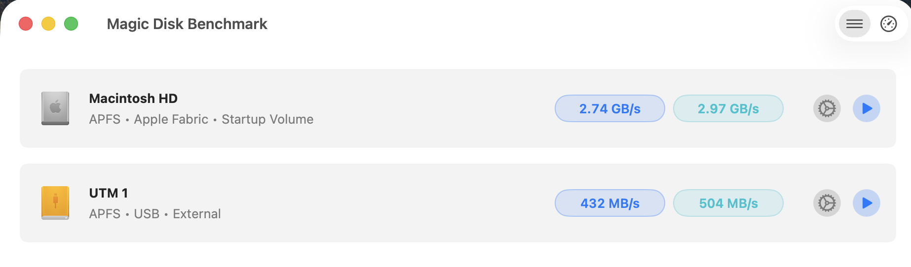
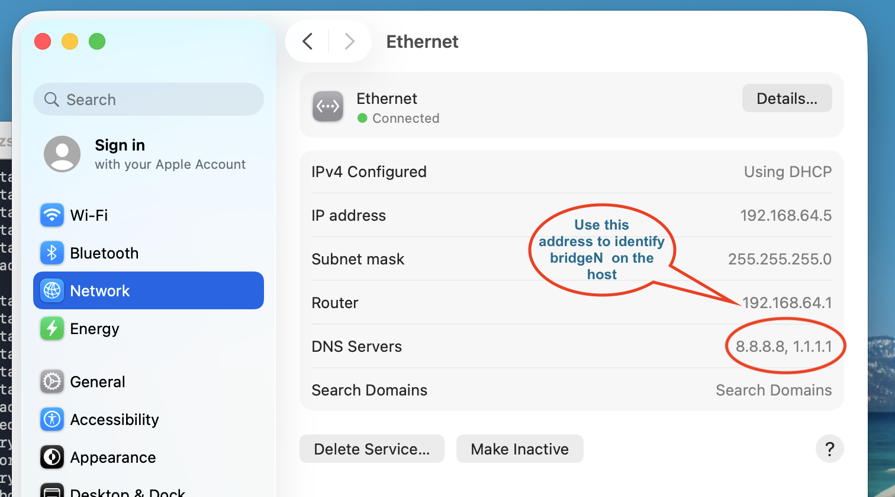
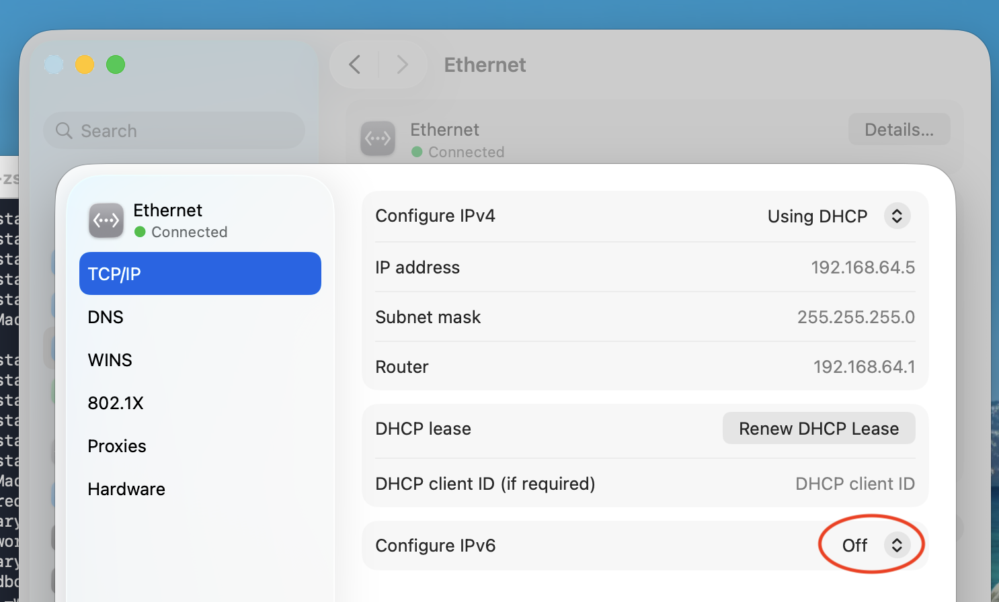
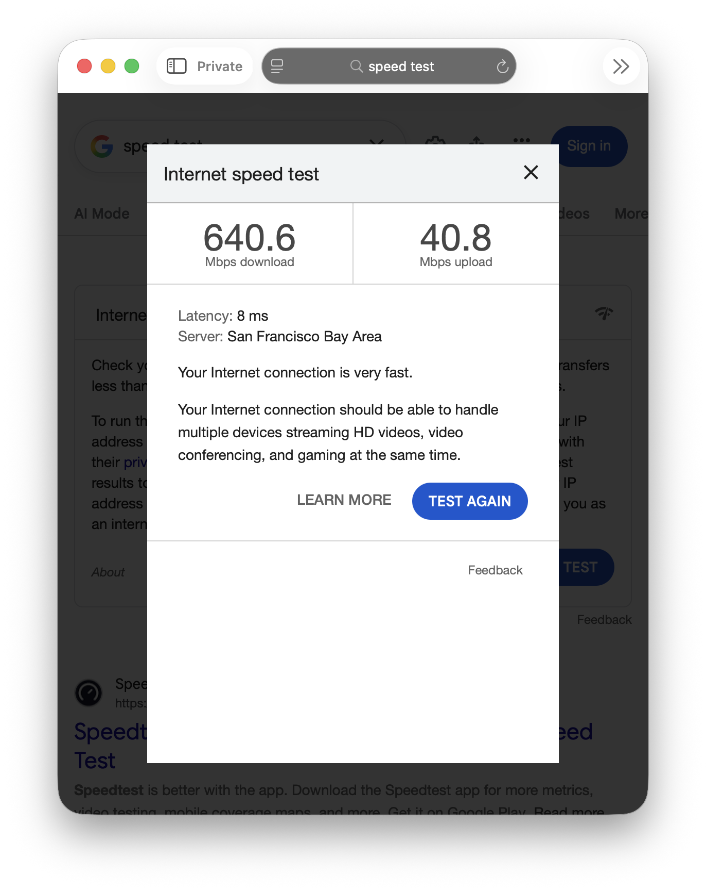
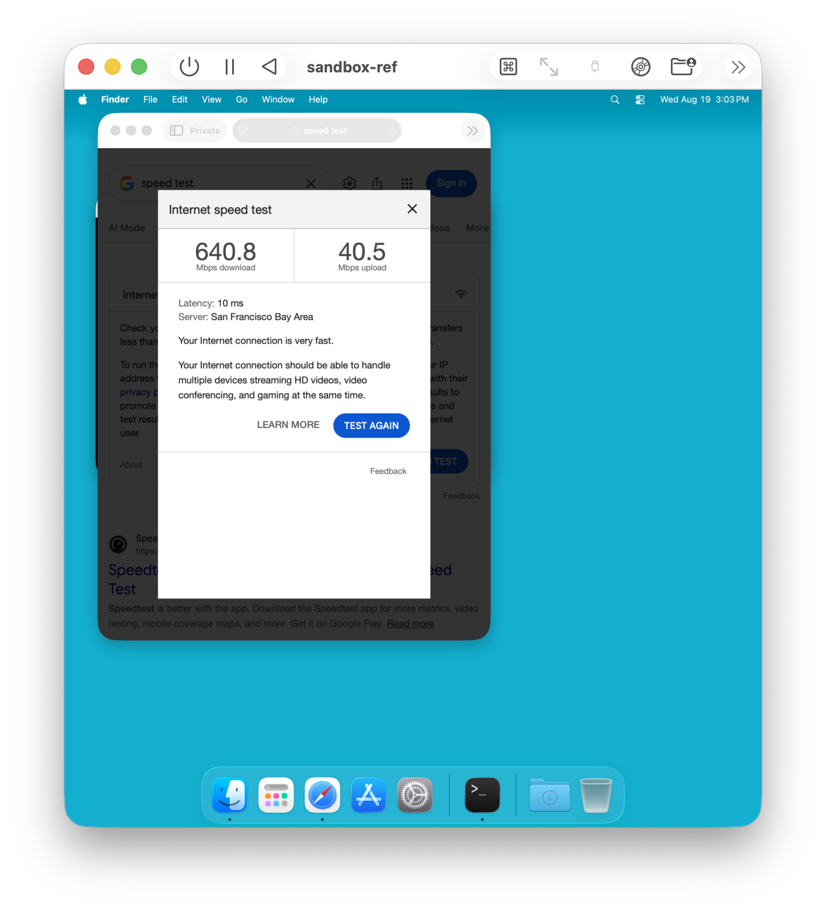
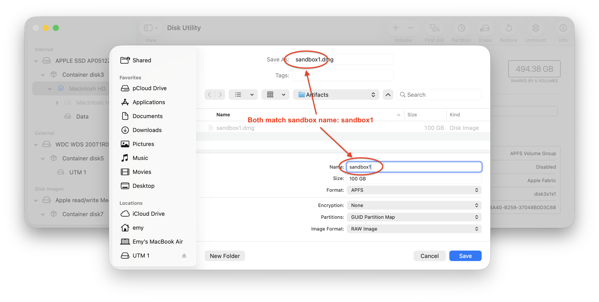
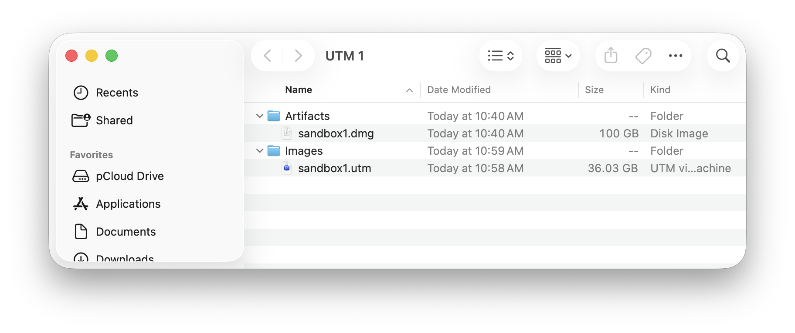

# UTM Sandbox For MacOS on Mac Apple Chip

<!-- TOC tocDepth:2..3 chapterDepth:2..6 -->

- [Scope](#scope)
- [Features](#features)
- [Setup Steps](#setup-steps)
  - [Install UTM](#install-utm)
  - [Prepare the external volume](#prepare-the-external-volume)
  - [Create a reference VM](#create-a-reference-vm)
  - [Setup the firewall on the host](#setup-the-firewall-on-the-host)
  - [Verify network access from the guest](#verify-network-access-from-the-guest)
  - [Create a sandbox from reference](#create-a-sandbox-from-reference)
- [Accessing the artifacts on host](#accessing-the-artifacts-on-host)

<!-- /TOC -->

## Scope

This document provides guidelines for running MacOS on a
[UTM](https://mac.getutm.app/) based VM on an Apple Chip Mac for the purpose of
creating a sandbox on the personal Mac where AI Agents could be run safely,
without fear of them altering/accessing personal files, accessing other devices
on the home network or altering the setup.


## Features

1. Assuming a typical home network with an internet router and a few wired and/or WiFi LANs, the VM is completely isolated from them.

1. The VM will have internet access.

1. The VM is allocated only a fraction of CPUs and memory resources, to prevent it from starving the host computer.

1. The VM will not share volumes with the host, rather it will mount `.dmg` volumes, one for the guest OS and a second one for transferring artifacts from the guest to the host, only when the VM is stopped. For additional security, the images could be stored on an external drive.

## Setup Steps

**NOTE!** Throughout the rest of the document `host` refers to the MacOS on the computer running (hosting) the VM whereas `guest` refers to the MacOS inside the VM.

### Install UTM

Download it from [UTM](https://mac.getutm.app/) or, to be nicer and to reward the effort behind it, from [App Mac Store](https://apps.apple.com/us/app/utm-virtual-machines/id1538878817?mt=12).

### Prepare the external volume

If an external drive is used, prepare a volume on it using [Disk
Utility](https://support.apple.com/en-au/guide/disk-utility/welcome/mac). For
the paranoid the volume should be encrypted. Assess the access speed to the
volume using a tool like [Magic Disk
Benchmark](https://apps.apple.com/us/app/magic-disk-benchmark/id1608793370?mt=12)
to get a sense if the VM will feel fast enough, values over 400 MB/s are OK.


### Create a reference VM

The reference VM holds the setup common to all types of sandboxes. Each of the
latter starts as a copy of the reference, followed by customizations.

**IMPORTANT!** If the sandbox firewall rules are already enabled (see [Setup the
firewall on the host](#setup-the-firewall-on-the-host)), first flush the sandbox
isolation rules on the host, or else the VM MacOS installation will hang since
it relies upon the UTM internal DNS server.

```bash
sudo pfctl -a com.utm.sandbox -F rules
```

- start UTM and select `Create a New Virtual Machine` with the following suggestions:

  - memory: 1/2 of the host
  - CPU: 1/2 of the host count
  - drive size: `64 GiB`

    The new VM will be named `macOS` by default.

- right click on the newly `macOS`, select `Edit` and make the following changes and save

    | Section | Parameter  | Suggestion |
    | ------- | ---------- | ---------- |
    | `Information` | `Name` | `sandbox-ref` |
    | `Virtualization` | `Enable Sound`<br>`Enable Clipboard Sharing` | deselected<br>deselected|
    | `Network` | `Network Mode` | `Shared Network` |
    | `Sharing` | | add path to `guest` folder to make it easier to install needed files |

- copy any custom files that may be needed during the setup under `guest/local` (git ignored); for instance I have `Terminal` settings `com.apple.Terminal.plist` file among others

- launch the VM, this should trigger the MacOS installation; suggested user: `admin`, `Admin` type

- log on as `admin`:

  - open a terminal and run the following script:

    ```bash
    cd "/Volumes/My Shared Files/guest"
    ./install-sandbox-setup.sh sandbox-ref
    ```

    It will install a setup script to be run as boot time, performing the following:
    - set the DNS servers to be external ones: Google (8.8.8.8) and Cloudflare (1.1.1.1)
    - disable IPv6
    - set hostname to sandbox-ref
    - keep the artifacts removable volume busy to prevent accidental ejection

  - verify the settings on the guest by checking `System Settings`, `Network`, `Ethernet`, remember the `Router` address:
    <a id="guest-network-settings"></a>
    

  - install desired apps such as `brew`, `Visual Studio Code`, etc

  - create user `agentbox` (`Regular` type), intended for running agents without privileges.

  - set up the desktop appearance for each user

### Setup the firewall on the host

MacOS uses [pf](https://www.openbsdhandbook.com/pf/) for firewall so for the
scope of this document `pf` and `firewall` may be used interchangeably.

If the sandbox firewall rules were previously flushed, reload them:

```bash
sudo pfctl -a com.utm.sandbox -f /etc/pf.anchors/com.utm.sandbox
```

otherwise proceed as follows:

- check if the provided rules need to be changed:
  - verify that the host IP address belongs to one of the [private
    CIDR](https://en.wikipedia.org/wiki/Private_network#Private_IPv4_addresses);
    open `System Settings`, `Network`, `Wi-Fi`, `Details`, `TCP/IP` on the host:
    <a id="host-network-settings"></a>

  - verify that name of the UTM bridge is `bridge100` by locating the host
    interface whose `inet` address matches the `Router` on the
    [guest](#guest-network-settings). Run on the host:

    ```bash
    ifconfig | sed -n '/^bridge[1-9]/,/^[[:space:]]*inet[[:space:]]/p'
    ```

    e.g. for the case above the router is `192.168.64.1`, so `bridge100`  is confirmed

    ```text
    bridge100: flags=8a63<UP,BROADCAST,SMART,RUNNING,ALLMULTI,SIMPLEX,MULTICAST> mtu 1500
    options=63<RXCSUM,TXCSUM,TSO4,TSO6>
    ether 9e:58:84:c0:48:64
    inet 192.168.64.1 netmask 0xffffff00 broadcast 192.168.64.255
    ```

- if either range or name are different, adjust [host/com.utm.sandbox](host/com.utm.sandbox) accordingly.

- install and activate the rules on the host:

  ```bash
  cd host
  ./install-host-sandbox-fw-rules.sh
  ```

- verify that the firewall is enabled and that the rules are loaded:

  ```bash
  cd host
  ./check-host-sandbox-fw.sh
  ```

### Verify network access from the guest

- build the list of IP addresses that should **not** be reachable from the guest:
  - the IP's in the [host](#host-network-settings) network settings
  - the IP marked to be used to identify the bridge device on the [guest](#guest-network-settings)
  
  For the case illustrated above the list is: `192.168.50.201 192.168.50.1 192.168.64.1`

- open a terminal window on the guest
  - ping the list built above, they should all timeout.
    e.g.

    ```bash
    for ip in 192.168.50.201 192.168.50.1 192.168.64.1; do
      echo "-----------------------------"
      ping -c 3 -W 200 $ip
    done
    ```

  - verify that each DNS resolver (external) can be reached
    e.g.

    ```bash
    for dns in 8.8.8.8 1.1.1.1; do
      echo "-----------------------------"
      host $dns $dns
    done
    ```

- on both host and guest open a browser, search for `Speed Test`, run it and compare the results

  | Host Speed Test | Guest Speed Test |
  | --------------- | ---------------- |
  |  |  |

### Create a sandbox from reference

The VM will mount `.dmg` based volumes, one for the guest OS and a second one
for transferring artifacts from the guest to the host, only when the VM is
stopped. The 2 should be stored under `Images` and `Artifacts` folders either
under a `UTM` top folder on the main volume of the host, or, preferably on an
external drive. 


The following assumes that the new sandbox will be named `sandbox1`:

- create the artifacts volume `sandbox1.dmg`

  **IMPORTANT!** The artifacts `.dmg` name should match that of the sandbox,
  otherwise the script that keeps the removal device busy on the guest to prevent
  its accidental removal will not be able to locate it.

  e.g.

  

- open `UTM` and duplicate the `sandbox-ref`, it will be assigned `sandbox-ref 2` name automatically

- edit `sandbox-ref 2` and
  - change its name to `sandbox1`
  - remove all (folder) sharing
  - add a new removable drive, selecting the `sandbox1.dmg` above; uncheck `Read Only?`

- if using an external drive, move `sandbox1` to it in `UTM`
e.g.


- after the first boot, log on as `admin` and run from a terminal command:

  ```bash
  /Library/Scripts/SandboxSetup/set-sandbox-name.sh sandbox1
  ```

- verify the settings:
  - open a terminal on guest and run:

    ```bash
    hostname
    ```

    it should be that set to the sandbox

  - open a terminal and verify the script that keeps the artifacts volume busy:

    ```bash
    sudo launchctl list | grep SandboxSetup
    804	0	com.utm.SandboxSetup
    pstree 804
    -+= 00804 root /bin/bash /Library/Scripts/SandboxSetup/sandbox-setup.sh
    \--- 02241 root sleep 1
    ```

    `sleep 1` indicates waiting for `/Volume/sandbox1` to be appear, whereas
    `sleep 3600` indicates that volume was found it is eject protected. If the
    latter it is safe to try to eject it, it should pop-up the warning that the
    device is busy. **CAUTION!** do not force eject!

## Accessing the artifacts on host

To prevent attacks via metadata through Finder / Spotlight actions, the
artifacts `.dmg` for a given sandbox should be mounted with browsing and
indexing disabled. To that end convenience scripts `mount-sandbox-artifacts.sh`
and `eject-sandbox-artifacts.sh` are provided under `hosts`:

```text
Usage: mount-sandbox-artifacts.sh PATH_TO_DMG [ro]

Mount PATH_TO_DMG to $SANDBOX_ARTIFACTS_ROOT/BASENAME, where:

    SANDBOX_ARTIFACTS_ROOT defaults to $HOME/Sandbox/Artifacts
    BASENAME is basename of PATH_TO_DMG
```

```text
Usage: eject-sandbox-artifacts.sh SANDBOX_NAME

Eject $SANDBOX_ARTIFACTS_ROOT/SANDBOX_NAME, where

    SANDBOX_ARTIFACTS_ROOT defaults to $HOME/Sandbox/Artifacts
```

**IMPORTANT!** While `mount-sandbox-artifacts.sh` will check if the `.dmg` is in
use by the VM, so it will not mount it, the VM does not make a similar check.
Always verify before starting the VM, for instance by running `hdiutil info`.

e.g.

```bash
hdiutil info
```

```text
framework       : 683.100.3
driver          : 683.100.3
================================================
image-path      : /Volumes/UTM 1/Artifacts/sandbox1.dmg
image-alias     : /Volumes/UTM 1/Artifacts/sandbox1.dmg
...
/dev/disk7s1	41504653-0000-11AA-AA11-00306543ECAC	/Users/emy/Sandbox/Artifacts/sandbox1
```

